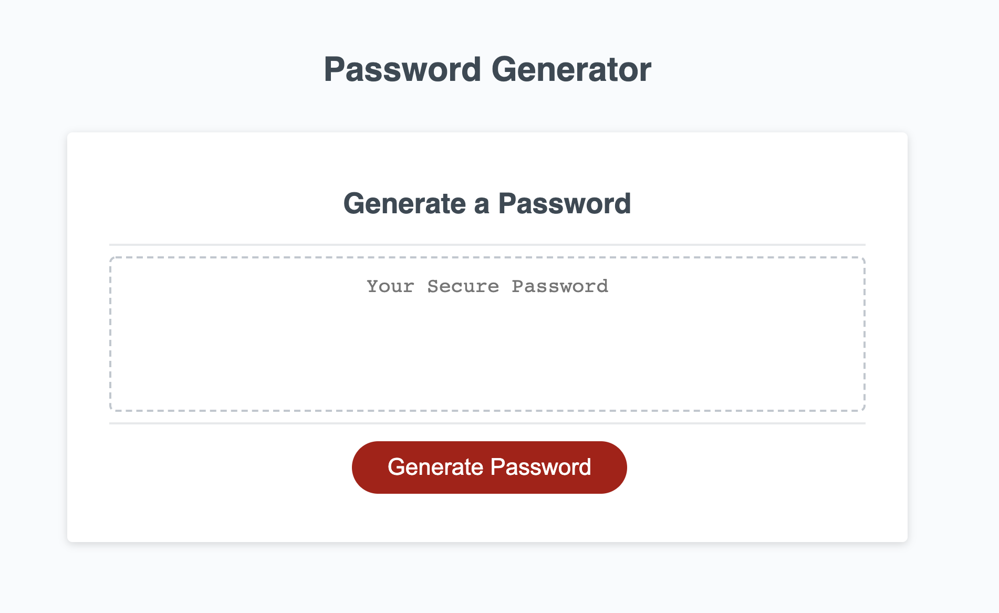

This is a random password generator.

The user will be prompted to input a series of choices which then will assemble a password.

When the user clicks "generate password" they are presented with a series of prompts for password criteria.
when prompted, the user can select the length of the password (Between 8-128 characters). 
Then they will be asked if they would like their password to include lowercase letters, uppercase letters, numberic and or special characters.
The input received is validated when all prompts are answered. Then a password is generated that matches the user criteria. It is presented in the "Your Secure Password" box.

The site was run through Chrome Dev Tools with no errors.

